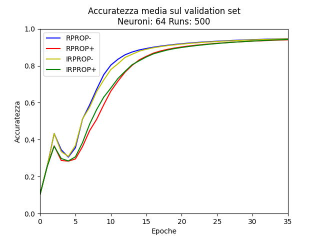
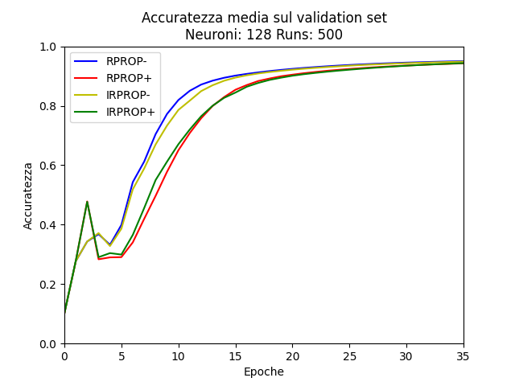

# Valutazione empirica degli algoritmi di apprendimento Rprop migliorati

## Sommario

Questo studio esplora le prestazioni di diverse varianti dell'algoritmo di ottimizzazione Rprop (Resilient Backpropagation) nell'ambito della classificazione del dataset MNIST. Il dataset MNIST è una collezione di immagini di cifre scritte a mano, comunemente utilizzato come benchmark nell'apprendimento automatico. Le varianti di Rprop considerate includono Rprop standard (Rprop-), Rprop con backtracking dei pesi (Rprop+), Improved Rprop (iRprop-), e Improved Rprop con backtracking dei pesi (iRprop+). Per ogni esecuzione e per ciascuna variante di Rprop, viene addestrata una rete neurale artificiale originaria e le sue prestazioni sono valutate attraverso grafici e tabelle che mostrano l'andamento dell'accuratezza media sul numero di esecuzioni, per ogni variante, e sui set di addestramento, validazione e test. La creazione della rete neurale viene realizzata mediante una libreria di funzioni creata ad hoc per questo progetto.


## Installazione e Utilizzo

Per utilizzare questa libreria e testare le implementazioni di Rprop e le sue varianti, è necessario scaricare la directory "data" da questo [link](https://communitystudentiunina-my.sharepoint.com/:f:/g/personal/marcello_russo_studenti_unina_it/EiPFCnSwqWRLqyyW8EQc_BABTgJt9vDTe7yOF3l9Z1OoFQ?e=A1JIAX) e inserire i suoi elementi nella nella directory "data" del progetto.

## Introduzione

Le reti neurali artificiali hanno rivoluzionato il campo dell'intelligenza artificiale e dell'apprendimento automatico, offrendo potenti strumenti per la risoluzione di problemi di classificazione o regressione, a seconda della continuità dell'output. La classificazione di immagini è un problema molto importante nell'ambito delle reti neurali artificiali; uno dei dataset più ampiamente utilizzati per la classificazione di immagini è il MNIST, composto da migliaia di immagini in scala di grigi di cifre scritte a mano. Questo dataset rappresenta una pietra miliare nel campo dell'apprendimento automatico e delle reti neurali, ed è spesso utilizzato come benchmark per valutare le prestazioni di nuovi algoritmi e modelli.

In questo contesto, il presente studio si propone di esplorare e analizzare l'utilizzo di reti neurali artificiali per la classificazione del dataset MNIST. In particolare, ci si concentrerà sull'addestramento di reti neurali utilizzando quattro varianti dell'algoritmo di apprendimento Rprop (Resilient Backpropagation), al fine di valutare l'impatto di tali varianti sulle prestazioni della rete neurale. Questo lavoro si basa sulla ricerca "[Empirical evaluation of the improved Rprop
learning algorithms](https://sci2s.ugr.es/keel/pdf/algorithm/articulo/2003-Neuro-Igel-IRprop+.pdf)" che ha esaminato le varianti di Rprop, tuttavia, a differenza di tale studio, verrà posta l'attenzione sull'analisi delle prestazioni delle reti neurali sul MNIST.

Nel corso di questo documento, sarà esaminata la libreria sviluppata ad hoc per la logica della rete, le varianti della Rprop considerate, l'architettura della rete neurale creata, i risultati degli esperimenti condotti e le principali conclusioni emerse dallo studio. L'obiettivo è quello di contribuire alla comprensione delle dinamiche di apprendimento delle reti neurali e di fornire insights utili per lo sviluppo di modelli più efficaci per la classificazione di immagini.

## uninaannpy

In questo capitolo, sarà analizzata la libreria sviluppata per l'implementazione e l'addestramento di reti neurali artificiali. Saranno esplorate le diverse componenti della libreria, inclusi i moduli per la gestione dei dataset, le funzioni di attivazione e di errore, nonché le implementazioni delle reti neurali stesse. Inoltre, saranno formalizzate le varianti dell'algoritmo di ottimizzazione Rprop (Resilient Backpropagation) considerate nell'addestramento delle reti.

### neural_network.py

Il modulo *neural\_network.py* offre un'implementazione per la creazione e l'addestramento di reti neurali artificiali multistrato completamente connesse. La classe *NeuralNetwork* è altamente configurabile, consentendo la specifica delle funzioni di attivazione, della funzione di errore e delle dimensioni degli strati di input, nascosti e di output.

Durante l'inizializzazione, i pesi e i bias sono generati casualmente per garantire una buona inizializzazione del modello, utilizzando una distribuzione normale con media 0 e deviazione standard 0.1, in notazione omogenea. La propagazione in avanti calcola gli output dei neuroni per ciascuno strato, trasformando l'input in una previsione dell'output. La backpropagation calcola i gradienti dei pesi e dei bias rispetto alla funzione di errore, permettendo l'aggiornamento dei parametri mediante la discesa del gradiente. Il modulo include il metodo Rprop, il quale implementa le diverse varianti tramite un parametro appartenente alla sottoclasse *RpropType* che indica il tipo di variante da utilizzare.

Le caratteristiche della rete neurale, come il numero di strati nascosti, le dimensioni dell'input e dell'output, i neuroni negli strati nascosti, le funzioni di attivazione e la funzione di errore, possono essere ottenute e stampate per un'analisi dettagliata.

### error_functions.py

Il modulo *error_functions.py* fornisce diverse funzioni per calcolare la perdita o l'errore tra le previsioni del modello e i valori desiderati durante il processo di addestramento delle reti neurali. La funzione *sum_of_squares* calcola la somma dei quadrati tra le previsioni del modello e i valori target, utile per problemi di regressione. La funzione *softmax* calcola la distribuzione di probabilità normalizzata utilizzata per problemi di classificazione multiclasse. La funzione *cross_entropy* calcola direttamente la cross-entropy tra l'output della rete e le etichette fornite, mentre la *cross_entropy_softmax* calcola la perdita attraverso la combinazione della softmax e della cross-entropy.

Queste funzioni sono essenziali per valutare quanto bene il modello si adatta ai dati di addestramento e per aggiornare i pesi e i bias durante il processo di apprendimento tramite l'algoritmo di backpropagation. La disponibilità di diverse funzioni di errore consente la flessibilità nell'adattare il modello alle specifiche esigenze del problema.

### activation_functions.py

Il modulo *activation_functions.py* fornisce diverse funzioni di attivazione utilizzate all'interno delle reti neurali artificiali. Include la funzione identità, che mantiene invariato l'input, la tangente iperbolica (*tanh*) per normalizzare i dati nell'intervallo tra -1 e 1, la ReLU (Rectified Linear Unit), che mantiene gli input positivi e annulla quelli negativi, e infine la Leaky ReLU, una variante della ReLU che aggiunge una pendenza costante per gli input negativi, garantendo una maggiore stabilità nell'apprendimento dei modelli.

Queste funzioni sono fondamentali per introdurre non linearità nei dati e consentono alle reti neurali di apprendere relazioni complesse tra input e output. Oltre a calcolare i valori delle funzioni di attivazione, il modulo fornisce anche le rispettive derivate, che sono essenziali per l'implementazione dell'algoritmo di backpropagation durante il processo di addestramento della rete.

### datasets.py

Il modulo *datasets.py* fornisce una serie di funzioni utili per l'estrazione e la preparazione dei dati dai dataset. In particolare, include funzioni per ottenere sottoinsiemi di dati per addestramento, validazione e test da un dataset MNIST. La funzione *get_mnist_training* estrae i dati di addestramento, la funzione *get_mnist_validation* estrae i dati di validazione e la funzione *get_mnist_test* estrae i dati di test. Ogni funzione restituisce una tupla contenente i dati di input e le rispettive etichette, inoltre, vi è una funzione ausiliaria *get_mnist_labels* che converte le etichette in formato one-hot per essere utilizzate nell'addestramento dei modelli di rete neurale. Questo modulo è utile per la preparazione dei dati prima di addestrare i modelli di machine learning sui dataset MNIST.

## Algoritmi Rprop

Nell'ambito dell'apprendimento supervisionato per le reti neurali, le tecniche di ottimizzazione basate sul gradiente costituiscono un pilastro fondamentale. Gli algoritmi adattivi basati sul gradiente, che utilizzano dimensioni del passo individuali, cercano di affrontare le sfide legate alla scelta dei tassi di apprendimento adeguati. Questo obiettivo viene raggiunto regolando attentamente l'aggiornamento dei pesi per ciascuna connessione durante il processo di apprendimento, con l'intento di minimizzare le oscillazioni e massimizzare le dimensioni dei passaggi di aggiornamento.

Nell'algoritmo di apprendimento Rprop, l'orientamento di ciascun aggiornamento del peso è determinato dal segno della derivata parziale della funzione di errore rispetto al peso. In questo contesto, una dimensione del passo, indicata come $\Delta_{ij}$, viene personalizzata per ciascun peso individualmente, indipendentemente dal valore assoluto delle derivate parziali. L'adattamento delle dimensioni del passo nell'algoritmo Rprop segue una regola dinamica in cui le dimensioni del passo vengono modificate in base ai segni delle derivate parziali consecutive. Se la derivata parziale mantiene lo stesso segno attraverso le iterazioni, la dimensione del passo viene aumentata, mentre un cambio di segno induce una riduzione della dimensione del passo. La seconda parte dell'algoritmo riguarda l'aggiornamento dei pesi, con variazioni distinte esistenti per le diverse versioni di Rprop. Queste versioni sono delineate dalle loro metodologie uniche per gestire l'aggiornamento dei pesi e l'adattamento delle dimensioni del passo, argomento che sarà esaminato nelle sottosezioni successive.

### Rprop standard

La Rprop standard, conosciuta anche come Rprop-, rappresenta una tecnica diffusa nell'ottimizzazione basata sui gradienti nei sistemi neurali utilizzati per l'apprendimento supervisionato. Questi algoritmi adattivi si concentrano sulla gestione delle dimensioni dei passaggi di apprendimento individuali, affrontando così la sfida di selezionare velocità di apprendimento adeguate. Durante il processo di apprendimento, si controlla l'aggiornamento dei pesi per ciascuna connessione al fine di ridurre le oscillazioni e ottimizzare le dimensioni dei passaggi di aggiornamento.

Consideriamo $w_{ij}$ come il peso associato alla connessione da un neurone $j$ a un neurone $i$, e $E$ come una misura di errore differenziabile rispetto ai pesi. Anche i parametri di bias vengono considerati come pesi di input costanti aggiuntivi. Gli apici indicano l'iterazione di apprendimento. Durante ogni iterazione, i nuovi pesi sono calcolati come:

$$
w_{ij}^{(t+1)} := w_{ij}^{(t)} + \Delta w_{ij}^{(t)} \quad (1)
$$

L'algoritmo di apprendimento termina quando viene soddisfatto un certo criterio di terminazione, ad esempio quando il numero di iterazioni $t$ supera un valore predefinito. Nel contesto dell'algoritmo di apprendimento Rprop, la direzione di ogni aggiornamento del peso è determinata dal segno della derivata parziale ${\partial E}/{\partial w_{ij}}$. Ogni peso $w_{ij}$ viene aggiornato utilizzando una dimensione di passo $\Delta_{ij}$ adattata individualmente per ciascun peso. La caratteristica distintiva di questo approccio è che le dimensioni dei passaggi di aggiornamento sono indipendenti dal valore assoluto delle derivate parziali:

$$
\Delta w_{ij}^{(t)} := -\text{sign}(\frac{\partial E}{\partial w_{ij}}^{(t)}) \cdot \Delta_{ij}^{(t)} \quad (2)
$$

L'operatore sign$(\cdot)$ restituisce $+1$ se il suo argomento è positivo, $-1$ se è negativo e $0$ altrimenti. Le $\Delta_{ij}$ possono essere inizializzate con una costante $\Delta_{0} = 0.1$, per esempio, oppure utilizzare la
distribuzione normale con media 0 e varianza 0.1, come nel caso di questa ricerca. Un'iterazione dell'algoritmo Rprop originale può essere suddivisa in due parti. La prima parte, l'aggiustamento delle dimensioni di passo, è essenzialmente identica per tutti gli algoritmi Rprop utilizzati in questo studio. Per ciascun peso $w_{ij}$, una dimensione di passo individuale $\Delta_{ij}$ viene regolata secondo la seguente regola:

```math
\Delta^{(t)}_{ij} :=
\begin{cases}
\min(\eta^+ \cdot \Delta^{(t-1)}_{ij},
\Delta_{\text{max}}) & \text{se } {\frac{\partial E}{\partial w_{ij}}^{(t-1)}} \cdot {\frac{\partial E}{\partial w_{ij}}^{(t)}} > 0 \\
\max(\eta^- \cdot \Delta^{(t-1)}_{ij}, \Delta_{\text{min}}) & \text{se } {\frac{\partial E}{\partial w_{ij}}^{(t-1)}} \cdot {\frac{\partial E}{\partial w_{ij}}^{(t)}} < 0 \\
\Delta^{(t-1)}_{ij} & \text{altrimenti}
\end{cases}  \quad (3)
```

Dove $0 < \eta^- < 1 < \eta^+$. Se la derivata parziale ${\partial E}/{\partial w_{ij}}$ mantiene lo stesso segno per passi consecutivi, la dimensione del passo viene incrementata, mentre se cambia segno, la dimensione del passo viene diminuita (lo stesso principio è utilizzato in altri metodi di apprendimento). Le dimensioni del passo sono limitate dai parametri $\Delta_{\text{min}}$ e $Delta_{\text{max}}$. Nota che per (1) e (2) vale:

```math
\frac{\partial E^{(t)}}{\partial \Delta^{(t-1)}_{ij}} = \frac{\partial E^{(t)}}{\partial w^{(t)}_{ij}} \frac{\partial w^{(t)}_{ij}}{\partial \Delta^{(t-1)}_{ij}} = - {\frac{\partial E}{\partial w_{ij}}^{(t)}} \text{sign}\left( {\frac{\partial E}{\partial w_{ij}}^{(t-1)}} \right) \quad (4)
```
Pertanto, la direzione del cambiamento di $\Delta_{ij}$ seguendo (3) è in accordo con un'ottimizzazione basata sul gradiente dell'errore di rete rispetto a $\Delta_{ij}$.

### Rprop con weight-backtracking

La variante Rprop con weight backtracking (Rprop+), implementa un concetto noto come *weight-backtracking* per migliorare l'addestramento delle reti neurali. Questo concetto comporta il ritiro di un aggiornamento precedente per alcuni o tutti i pesi della rete neurale, il che viene deciso mediante un'euristica.

Dopo aver regolato le dimensioni dei passi come descritto nell'equazione (\ref{eq:delta}), gli aggiornamenti dei pesi $\Delta w_{ij}$ vengono determinati in base a due casi.
Se il segno della derivata parziale non è cambiato, viene eseguito un normale aggiornamento del peso:

```math
\begin{aligned}
\textbf{if } & \frac{\partial E}{\partial w_{ij}}^{(t-1)} \cdot \frac{\partial E}{\partial w_{ij}}^{(t)} \geq 0 \textbf{ then } \\
& \Delta w_{ij}^{(t)} := - \text{sign}\left(\frac{\partial E}{\partial w_{ij}}^{(t)}\right) \cdot \Delta^{(t)}_{ij}
\end{aligned} \quad (5)
```
In caso di cambiamento di segno della derivata parziale, l'aggiornamento precedente del peso viene annullato:

```math
\begin{aligned}
\textbf{if } & \frac{\partial E} {\partial w_{ij}}^{(t-1)} \cdot \frac{\partial E}{\partial w_{ij}}^{(t)} < 0 \textbf{ then } \{ \\
& \Delta w_{ij}^{(t)} := -\Delta w_{ij}^{(t-1)}; \\
& \frac{\partial E}{\partial w_{ij}}^{(t)} := 0 \\
\}
\end{aligned} \quad (6)
```

Impostare la derivata memorizzata a zero impedisce un aggiornamento del tasso di apprendimento nella prossima iterazione, poiché il ramo \textit{altrimenti} nell'equazione (\ref{eq:delta}) diventa attivo. Questo può essere considerato come un trucco di implementazione; lo stesso effetto potrebbe essere ottenuto aggiungendo un flag all'algoritmo.

### Improved Rprop con weight-backtracking

La prima modifica dell'algoritmo Rprop si basa sulla considerazione che un cambiamento di segno della derivata parziale implica che l'algoritmo abbia saltato un minimo locale, ma non indica se l'aggiornamento del peso abbia causato un aumento o una diminuzione dell'errore. Pertanto, la decisione presa in (6) di annullare tale passo è in qualche modo arbitraria. Ancora peggio, sembra controproducente ripristinare un passo se l'errore complessivo è diminuito. L'idea della variante Improved Rprop con weight-backtracking (iRprop+) è rendere il ribaltamento del passo dipendente dall'evoluzione dell'errore.

C'è un motivo per non annullare un passo che non ha causato un cambiamento del segno della derivata parziale corrispondente: supponiamo che i pesi influenzino l'errore di rete indipendentemente l'uno dall'altro e che la funzione di errore abbia un solo ottimo locale all'interno di un ipercubo $U \subseteq \mathbb{R}^n$, dove $n$ è il numero dei pesi, e $\textbf{w}^{(t)} \in U$. Allora ogni cambiamento di $\textbf{w}^{(t)}_i$ nella direzione di $-{\partial E}^{(t)}/{\partial w_i}^{(t)}$ avvicina il vettore dei pesi all'ottimo locale in $U$ se $\textbf{w}^{(t+1)} \in U$ e $\text{sign}\left({\partial E}^{(t)}/{\partial w_i}^{(t)}\right) = \text{sign}\left({\partial E}^{(t-1)}/{\partial w_i}^{(t+1)}\right)$. Da queste considerazioni risulta che gli aggiornamenti dei pesi che hanno causato cambiamenti nei segni delle derivate parziali corrispondenti vengano annullati, ma solo in caso di aumento dell'errore. Sostituiamo (6) con:


```math
\begin{aligned}
\textbf{if } & \frac{\partial E} {\partial w_{ij}}^{(t-1)} \cdot \frac{\partial E}{\partial w_{ij}}^{(t)} < 0 \textbf{ then } \{ \\
& \Delta w_{ij}^{(t)} := 
\begin{cases}
-\Delta w_{ij}^{(t-1)} & \text{se } E^{(t)} > E^{(t-1)} \\
0 & \text{altrimenti}
\end{cases} \\
& \frac{\partial E}{\partial w_{ij}}^{(t)} := 0 \\
\}
\end{aligned} \quad (7)
```

In (7), uniamo informazioni "locali" sulla superficie dell'errore (il segno della derivata parziale della funzione di errore rispetto a un peso) con informazioni più "globali" (l'errore di rete) per determinare, per ciascun peso individualmente, se annullare o meno un passo. Questo approccio combina il punto di vista strettamente "globale", in cui l'intero aggiornamento precedente per tutti i pesi viene annullato se $E^{(t)} > E^{(t-1)}$.


### Improved Rprop senza backtracking


Nel caso in cui la derivata cambi di segno, l'algoritmo iRprop+ descritto nella sezione precedente esegue due azioni aggiuntive rispetto alla semplice riduzione della dimensione del passo: in primo luogo, applica un rollback dei pesi solo nei rari casi in cui l'errore complessivo aumenta. In secondo luogo, forza sempre la derivata ${\partial E}^{(t)}/{\partial w_{ij}}^{(t)}$ a zero. L'algoritmo che prende il nome di Improved Rprop (iRprop-) è identico a iRprop+ ma senza backtracking dei pesi. Quando il segno di una derivata parziale cambia, iRprop- diminuisce la dimensione del passo corrispondente senza influenzare il peso stesso. Inoltre, si assicura che nel passaggio successivo il peso venga modificato utilizzando la dimensione del passo ridotta. È importante notare che una dimensione del passo non può essere ulteriormente ridotta se lo è stata nel passaggio precedente. L'unica variazione rispetto a Rprop- è l'impostazione della derivata a zero quando questa cambia segno rispetto all'epoca precedente.


## Implementazione

L'implementazione dei quattro tipi di Rprop è gestita attraverso una singola funzione che seleziona la variante da utilizzare in base a un parametro. Questo approccio consente di gestire le parti comuni dell'algoritmo insieme alle istruzioni specifiche per ciascuna variante, semplificando il codice e rendendolo più efficiente. Lo pseudocodice della funzione *rprops* contenuta nel modulo *neural_network.py* è illustrato in (8). La scelta di integrare tutte le varianti in un unico algoritmo è stata dettata dalla loro notevole similarità, che permette di evitare duplicazioni nel codice.


## Esperimenti

Nel corso degli esperimenti condotti, sono state esplorato tre diverse architetture di reti neurali per il problema di classificazione del dataset MNIST. È importante notare che il layer di input è costituito da 784 neuroni, corrispondenti ai 28x28 pixel delle immagini MNIST, mentre l'output è composto da 10 neuroni, rappresentativi delle dieci classi del dataset. Le architetture delle reti neurali differiscono esclusivamente per la dimensione effettiva della rete, con 32, 64 e 128 neuroni nell'unico strato nascosto. Per quest'ultimo, si è impiegata la funzione di attivazione Leaky ReLU, mentre per il layer di output si è utilizzata l'identità, per preservare i valori di probabilità calcolati dalla funzione di errore. Quest'ultima, in particolare, è la \textit{cross-entropy softmax}, comunemente utilizzata per problemi di classificazione multiclasse, in grado di calcolare le probabilità di appartenenza a ciascuna classe del problema. Il numero di epoche di addestramento è stato fissato a 35 e il tasso di apprendimento a $10^{-5}$, mentre il set di addestramento è stato suddiviso in un 80\% per il training effettivo e un 20\% per la validazione. Prima dell'addestramento, i dati sono stati mescolati per garantire una maggiore robustezza e generalizzazione del modello. Durante gli esperimenti, viene effettuato il train di cinquecento reti  con le quattro varianti dell'algoritmo di ottimizzazione Rprop descritte nella sezione precedente, al fine di valutare le metriche di performance tra di esse. In particolare, verranno esaminati grafici e tabelle relativi a metriche come l'errore sui set di addestramento e di validazione, l'accuratezza sui set di addestramento, di validazione e di test, oltre al tempo di esecuzione. Queste valutazioni verranno eseguite per ogni addestramento, per ciascuna variante di algoritmo e per ogni dimensione considerata. Per ogni metrica, verrà considerata sia la media delle 500 esecuzioni, data la natura aleatoria della rete, sia la varianza rapportata alla media per poterla confrontare con gli altri algoritmi.


## Risultati e conclusioni

Nel presente capitolo vengono presentate tre tabelle relative alle diverse dimensioni dei dataset utilizzati per valutare le prestazioni degli algoritmi di ottimizzazione Rprop. Ogni tabella riporta le medie delle metriche di performance ottenute attraverso 500 esecuzioni per ciascuna variante di Rprop, nonché la varianza del tempo di esecuzione, l'unico parametro significativo sotto questo aspetto.

Dalle tabelle emerge un trend interessante: le varianti degli algoritmi Rprop senza weight backtracking (Rprop- e iRprop-) sembrano presentare prestazioni superiori rispetto alle controparti che ne fanno uso. Questa osservazione è supportata dall'accuratezza media più elevata ottenuta da Rprop- e iRprop- su tutti e tre i set di dati considerati.


|          32 neuroni     |500 esecuzioni| Algoritmi |         |         |         |
|-------------------------|--------------|----------|---------|---------|---------|
|                         |              | Rprop-   | Rprop+  | iRprop- | iRprop+ |
| **Accuratezza**         | Train        | 0.94938  | 0.93936 | 0.9503  | 0.94689 |
|                         | Validation   | 0.93437  | 0.92708 | 0.93439 | 0.93202 |
|                         | Test         | 0.93698  | 0.92941 | 0.93705 | 0.92941 |
| **Errore**              | Train        | 8239.03  | 9839.29 | 8106.89 | 8709.11 |
|                         | Validation   | 3029.93  | 3325.29 | 3090.95 | 3201.24 |
| **Tempo**               | Media        | 16.74    | 20.51   | 10.54   | 18.42   |
|                         | Varianza     | 13.35    | 37.19   | 3.34    | 21.18   |


|        64 neuroni       |500 esecuzioni| Algoritmi |         |        |         |
|-------------------------|--------------|-----------|---------|--------|---------|
|                         |              | Rprop-    | Rprop+  | iRprop-| iRprop+ |
| **Accuratezza**         | Train        | 0.96134   | 0.95145 | 0.96154| 0.95609 |
|                         | Validation   | 0.94667   | 0.94051 | 0.94566| 0.94215 |
|                         | Test         | 0.94673   | 0.94035 | 0.94586| 0.94035 |
| **Errore**              | Train        | 6271.99   | 7834.69 | 6331.98| 7376.01 |
|                         | Validation   | 2648.43   | 2870.71 | 2820.66| 3011.74 |
| **Tempo**               | Media        | 24.54     | 14.25   | 14.60  | 14.24   |
|                         | Varianza     | 33.29     | 2.15    | 1.02   | 0.61    |

|         128 neuroni     |500 esecuzioni| Algoritmi |         |        |         |
|-------------------------|--------------|----------|---------|--------|---------|
|                         |              | Rprop-   | Rprop+  | iRprop-| iRprop+ |
| **Accuratezza**         | Train        | 0.972    | 0.9594  | 0.97114| 0.96327 |
|                         | Validation   | 0.95019  | 0.94276 | 0.94858| 0.94342 |
|                         | Test         | 0.95291  | 0.94535 | 0.95153| 0.94535 |
| **Errore**              | Train        | 4599.94  | 6648.41 | 4905.60| 6539.45 |
|                         | Validation   | 2553.69  | 2800.12 | 2900.33| 3255.85 |
| **Tempo**               | Media        | 34.90    | 24.58   | 25.45  | 25.65   |
|                         | Varianza     | 35.32    | 1.98    | 2.74   | 14.93    |


Tuttavia, una considerazione importante riguarda il tempo di esecuzione: l'algoritmo Rprop- risulta essere più lento rispetto alle altre varianti e presenta una varianza significativamente più alta. D'altra parte, iRprop- emerge come la variante che offre un'elevata accuratezza, tempi di esecuzione tra i più bassi e varianza minima.





L'analisi dei grafici conferma ulteriormente le differenze tra le varianti con e senza weight backtracking, evidenziando un netto miglioramento nelle prestazioni di Rprop- e iRprop- nelle epoche centrali dell'addestramento.

In conclusione, il presente studio ha esplorato le prestazioni di diverse varianti dell'algoritmo di ottimizzazione Rprop su un insieme di dati eterogenei. Attraverso un'analisi accurata delle metriche di performance e dei tempi di esecuzione, si è potuto valutare l'impatto delle diverse configurazioni degli algoritmi sull'efficacia e sull'efficienza dell'apprendimento automatico.
I risultati ottenuti indicano che le varianti di Rprop senza weight backtracking (Rprop- e iRprop-) tendono a mostrare prestazioni superiori in termini di accuratezza predittiva rispetto alle controparti che ne fanno uso. Tuttavia, è emerso che la scelta dell'algoritmo migliore dipende anche dalla specificità del problema e dalle preferenze relative all'importanza di accuratezza e tempo di esecuzione.
Inoltre, è stato osservato che l'algoritmo iRprop- si distingue per una combinazione vantaggiosa di elevate prestazioni e tempi di esecuzione e varianza ridotti.
